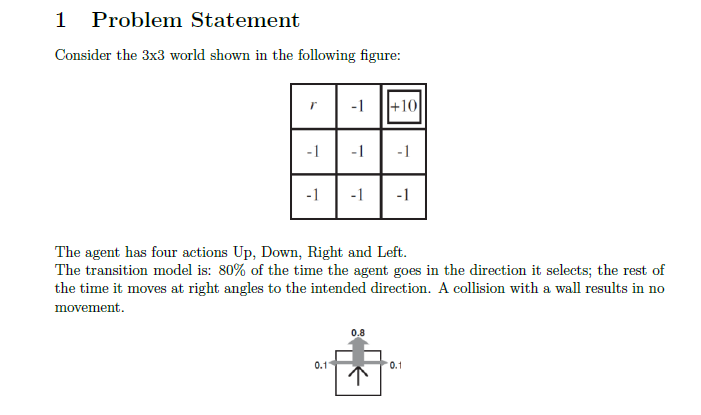
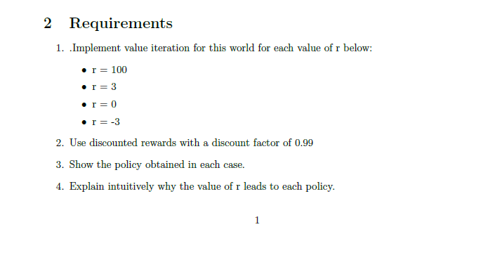
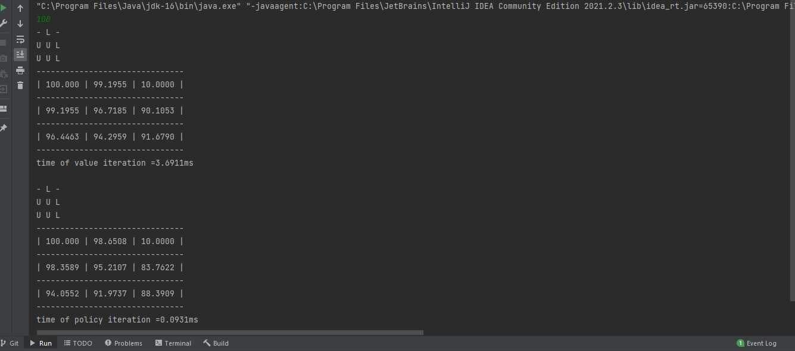
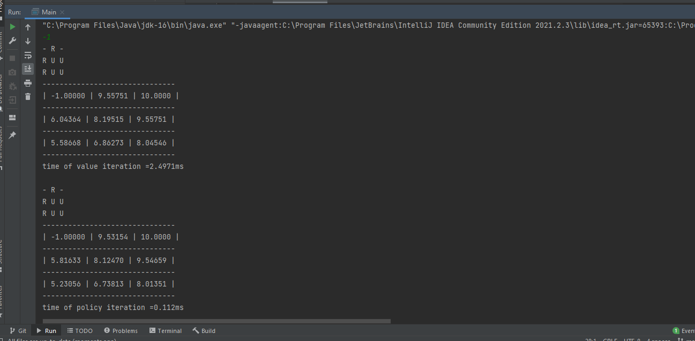

# Markov-Decision-Processes-Lab  AI _ lab

* This lab show how agent go to the goal state which have maximum value with smallest moves.
* r is the maximum reward .
* The problem statement is:
.

* The requirement is : 
.

* After try r=100 the result of value and process iteration is :
.

* After try r=-1 the result of value and process iteration is :
.

